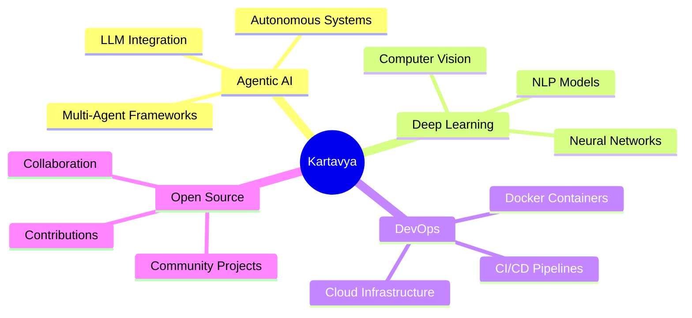

<div align="center">

# 👋 Hey there! I'm Kartavya Suryawanshi


</div>

---

<div align="center">

## 🚀 About Me

<table>
<tr>
<td width="50%">

```yaml
kartavya:
  location: "Building the Future"
  current_focus:
    - Agentic AI Systems
    - Deep Learning Models
    - Scalable DevOps
  interests: 
    - Neural Networks
    - Autonomous Agents
    - Cloud Architecture
    - Open Source
  learning: "Always 🌱"
```

</td>
<td width="50%">


</td>
</tr>
</table>

</div>

---

<div align="center">

## 🎯 Core Expertise

<table>
<tr>
<td align="center" width="25%">

<br><b>Agentic AI</b>
<br><sub>Building Intelligent Systems</sub>
</td>
<td align="center" width="25%">

<br><b>Deep Learning</b>
<br><sub>Neural Networks & ML</sub>
</td>
<td align="center" width="25%">

<br><b>Full Stack Dev</b>
<br><sub>Frontend + Backend</sub>
</td>
<td align="center" width="25%">

<br><b>DevOps</b>
<br><sub>Docker & Cloud</sub>
</td>
</tr>
</table>

</div>

---

<div align="center">

## 💻 Tech Arsenal

### 🤖 AI & Machine Learning


### 🎨 Frontend Universe


### ⚙️ Backend & DevOps


### 🛠️ Tools & More


</div>

---

<div align="center">

## 📊 GitHub Analytics


<table>
<tr>
<td width="50%">

</td>
<td width="50%">

</td>
</tr>
</table>


</div>

---

<div align="center">

## 🎯 Current Focus Areas



</div>

---

<div align="center">

## 🌐 Let's Connect!

<a href="https://linkedin.com/in/Kartavya-Suryawanshi">
  
</a>
<a href="https://kartavya-portfolio-pearl.vercel.app/">
  
</a>

<br><br>

### 💡 "Building the future, one commit at a time"


</div>

---


<div align="center">

### ⭐ From [Kartavya Suryawanshi](https://github.com/Kartavya728) - Always Learning, Always Building

</div>